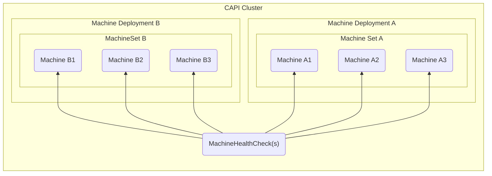
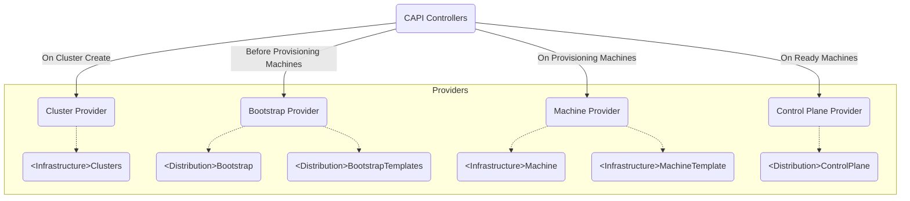

# What is Cluster API (CAPI)?

[Cluster API (CAPI)](https://cluster-api.sigs.k8s.io/introduction.html) is a declarative API for provisioning and managing Kubernetes clusters.

Once CAPI is installed, users are expected to use [`clusterctl`](https://cluster-api.sigs.k8s.io/clusterctl/overview.html), a command line tool that supports commands like:
- `clusterctl init` to install the CAPI and CAPI Provider components that listen to CAPI and CAPI Provider CRDs
- `clusterctl generate cluster` to create the Kubernetes manifest that defines a CAPI Cluster, which consists of CAPI and CAPI Provider CRDs
- `clusterctl get kubeconfig` to get the `KUBECONFIG` of a CAPI-provisioned cluster to be able to communicate with it

## Installing CAPI

To use CAPI, a user must install the **CAPI controllers & CRDs** and one or more **CAPI "Provider" controllers & CRDs** onto a single cluster known as the **local / management** cluster.

This is generally achieved by running `clusterctl init`.

Once CAPI is installed, to create a cluster managed by CAPI (also known as a **downstream** cluster), a user will have to create a number of CAPI resources at the same time in the **local / management** cluster that reference CAPI Provider resources that are created alongside it, including:
- One or more `Machine`s, each of which identify a `<Infrastructure>Machine` and `<Distribution>Bootstrap` CR that implements it
    - A `MachineDeployment` / `MachineSet` similarly references a `<Infrastructure>MachineTemplate` and `<Distribution>BootstrapTemplate` CRs to create a set of `Machine`s, `<Infrastructure>Machine`s, and `<Distribution>Bootstrap`s per replica requested in the spec

> **Note**: `MachineDeployment` : `MachineSet` : `Machine` has the same relationship as `Deployment` : `ReplicaSet` : `Pod`

- A `Cluster`, which identifies a `<Distribution>Cluster` and `<Distribution>ControlPlane` CR that implements it

- One or more `MachineHealthCheck`s, each of which identify periodic actions that need to be executed on `Machine`s to verify they are healthy

> **Note**: On a failed `MachineHealthCheck`, a `Machine` that is part of a `MachineSet` gets deleted and replaced with a fresh `Machine`

You can visualize the relationship between CAPI CRDs **alone** with the following graph:

The manifest containing these resources is what is normally produced by running `clusterctl generate cluster` with the appropriate command-line arguments.

Once these resources are created, it's expected that the CAPI "Provider" controllers will do the "real" work to provision the cluster.

## How Does CAPI Provision Clusters?

CAPI's general workflow for provisioning clusters involves the following steps of "real" work:
1. Create cluster-level infrastructure pieces **(handled by Cluster Infrastructure Provider)**
2. **ONLY IF** using `MachineDeployment` / `MachineSet`: Create `Machine`, `<Infrastructure>Machine`, and `<Distribution>Bootstrap` objects resources for each replica requested in the `MachineSet` spec **(handled by CAPI Controllers)**
3. Create a Machine Bootstrap Secret per `<Distribution>Bootstrap` that contains the script that needs to be installed right after provisioning a machine to add it to the Kubernetes cluster **(handled by Bootstrap Provider)**
4. Provision a physical server per `<Infrastructure>Machine` by contacting the infrastructure provider (i.e. AWS, Azure, etc.) and running the bootstrap script in the Machine Bootstrap Secret on the machine before marking it as Ready **(handled by Machine Provider)**)
5. Initialize the cluster's controlplane (only once all `Machine`s are marked as Ready) and join the bootstrapped nodes onto the controlplane **(handled by ControlPlane Provider)**

Once the control plane has been initialized, the Control Plane Provider maintains a `KUBECONFIG` that can be retrieved by running `clusterctl get kubeconfig` to access the newly provisioned downstream cluster's Kubernetes API.

## What is a CAPI Provider?

CAPI has the concept of **providers**, or controllers that are implemented by third-parties (i.e. AWS, Azure, Rancher, etc.) that operate on their own custom CRDs to manage the underlying infrastructure.

In essence, the model for CAPI's cluster provisioning workflow is to execute provisioning with a series of "hand-offs" to providers who implement the "real" code, e.g.
1. User creates a `MachineDeployment`, `MachineSet`, `Machine`, or `Cluster` CR referencing one or more provider CRs that the user also creates, like `<Infrastructure>MachineTemplate`, `<Infrastructure>Machine`, `<Infrastructure>Cluster`, or `<Infrastructure>ControlPlane` by running a single command like `clusterctl generate cluster [name] --kubernetes-version [version] | kubectl apply -f -`
2. The provider detects the creation of its own CRs and does some action. **CAPI watches the provider CRs, but does no action till the provider is done**
3. Once the provider is done processing, the provider updates **certain, well-defined CAPI fields** on its own CRs and the CAPI controllers spring into action; on detecting that change in the provider CRs referenced by a CAPI CR, they **copy over the values of those CAPI fields** from the provider CR to the CAPI CR and persist the modified CAPI CR onto the cluster
4. On detecting the update to the CAPI resource for those well-defined CAPI fields, CAPI is able to continue the provisioning process until the next "hand-off"

To visualize what this "hand-off" workflow looks like, here's a neat diagram:

> **Note**: Without any providers, CAPI would not be able to do anything since no one is executing the other side of the "hand-off"; it relies on providers to respond back with information on those desired fields to continue execution. This is why you need to deploy CAPI with at least one provider, which usually defaults to the [KubeAdm](https://kubernetes.io/docs/reference/setup-tools/kubeadm/) CAPI provider.

> **Note**: The reason why providers create their own custom CRDs is so that they have full control over adding additional fields under `.status`, `.spec`, or whatever other fields they would like to expose on their CRDs. 
>
> For example, if AWS would like to expose the ability to specify a network security group that will be tied to the provisioned machine (which may not translate to what an on-prem CAPI provider may want to allow users to be able to configure), AWS alone can offer that option in the `.spec` field of its `AWSMachine` CR but CAPI's corresponding `Machine` CR would not need to expose such a field.
>
> The only expectation that CAPI has in turn is that the CRDs themselves have to have certain specific well-defined `status` and `spec` fields, depending on the type of resource that CRD represents. These expectations are outlined in its [provider contract documentation](https://cluster-api.sigs.k8s.io/developer/providers/contracts.html), such as the fact that any CRD implementing `Cluster` needs to have `.spec.controlPlaneEndpoint` so that CAPI can copy that field over to the CAPI `Cluster` CR's `.spec.controlPlaneEndpoint`.
>
> As long as the CRD has those fields, it can be used in the `*Ref` fields (i.e. `infrastructureRef`, `controlPlaneRef`, `bootstrap.configRef`, etc.) of a CAPI CR.

## Types Of CAPI Providers

### (Cluster) Infrastructure Provider

A [Cluster Infrastructure Provider](https://cluster-api.sigs.k8s.io/developer/providers/cluster-infrastructure.html) is the **first** provider that gets called by the series of hand-offs from CAPI.

This provider is expected to implement the following CRD:
- `<Infrastructure>Cluster`: referenced by the `.spec.infrastructureRef` of a CAPI `Cluster` CR

On seeing a `<Infrastructure>Cluster` (i.e. `AWSCluster`) for the first time, a Cluster Infrastructure Provider is supposed to create and manage any of the **cluster-level** infrastructure components, such as a cluser's Subnet(s), Network Security Group(s), etc. that would need to be created before provisioning any machines.

> **Note**: As a point of clarification, Rancher's Cluster Infrastructure Provider's CRD is called an `RKECluster` since it is used as the generic Cluster Infrastructure CR for multiple infrastructure providers, although in theory Rancher should be having `DigitalOceanCluster`s or `LinodeCluster`s instead.
>
> This is because Rancher today does not support creating or managing **cluster-level infrastructure components** (which would normally be infrastructure-provider-specific) on behalf of downstream clusters.

Then, once the downstream cluster's API is accessible, the Cluster Infrastructure Provider is supposed to fill in the `<Infrastructure>Cluster` with the controlplane endpoint that can be used by `clusterctl` to access the cluster's Kubernetes API; this is then copied over to the CAPI `Cluster` CR along with some other status fields.

### Bootstrap Provider

A [Bootstrap Provider](https://cluster-api.sigs.k8s.io/developer/providers/bootstrap.html) is the **second** provider that gets called by the series of hand-offs from CAPI.

This provider is expected to implement the following CRDs:
- `<Distribution>Bootstrap`: referenced by the `.spec.bootstrap.ConfigRef` of a CAPI `Machine` CR
- `<Distribution>BootstrapTemplate`: referenced by the `.spec.bootstrap.ConfigRef` of a CAPI `MachineDeployment` or `MachineSet` CR

On seeing a `<Distribution>Bootstrap` (i.e. `RKEBootstrap`), the Bootstrap Provider is expected to create a **Machine Bootstrap Secret** that is referenced by the `<Distribution>Bootstrap` under `.status.dataSecretName`.

This **Machine Bootstrap Secret** is expected to contain a script (i.e. "bootstrap data") that should be run on each provisioned machine before marking it as ready; on successfully running the script, the machine is expected to have the relevant Kubernetes components onto the node for a given **Kubernetes distribution (i.e. kubeAdm, RKE, k3s/RKE2)**

### Machine (Infrastructure) Provider

A Machine Provider (also known as a [Machine Infrastructure Provider](https://cluster-api.sigs.k8s.io/developer/providers/machine-infrastructure.html)) is the **third** provider that gets called by the series of hand-offs from CAPI.

Machine Providers are expected to implement the following CRDs:
- `<Infrastructure>Machine`: referenced by the `.spec.infrastructureRef` of a CAPI `Machine` CR
- `<Infrastructure>MachineTemplate`: referenced by the `.spec.infrastructureRef` of a CAPI `MachineSet` or `MachineDeployment` CR

> **Note** When CAPI sees a `MachineDeployment` / `MachineSet` with a given `<Infrastructure>MachineTemplate`, it will automatically create both a `Machine` and `<Infrastructure>Machine` resource, where the `<Infrastructure>Machine`'s specification exactly matches what was provided in the `<Infrastructure>MachineTemplate`.
>
> The reason why this is necessary is because `<Infrastructure>MachineTemplate`s are mutable, whereas `<Infrastructure>Machine`s are immutable; on modifying a `<Infrastructure>MachineTemplate`, the next time that a `MachineDeployment` / `MachineSet` needs to create a `Machine`, the new `<Infrastructure>Machine` will match the new `<Infrastructure>MachineTemplate`, whereas older machines will continue to use the older version of what was contained in the `<Infrastructure>MachineTemplate` since their `<Infrastructure>Machine` remains unchanged.

On seeing the creation of an `InfrastructureMachine`, a Machine Provider is responsible for **provisioning the physical server** from a provider of infrastructure (such as AWS, Azure, DigitalOcean, etc. as listed [here](https://cluster-api.sigs.k8s.io/user/quick-start.html#initialization-for-common-providers)) and **running a bootstrap script on the provisioned machine** (provided by the [Bootstrap Provider](#bootstrap-provider) via the **Machine Bootstrap Secret**).

The bootstrap script is typically run on the provisioned machine by providing the bootstrap data from the **Machine Bootstrap Secret** as a `cloud-init` script; if `cloud-init` is not available, it's expected to be directly run on the machine via `ssh`.

### Control Plane Provider

A [Control Plane Provider](https://cluster-api.sigs.k8s.io/developer/providers/machine-infrastructure.html)) is the **fourth** provider that gets called by the series of hand-offs from CAPI.

A control plane provider actually handles [installing Kubernetes components](../controllers/00_introduction.md#what-does-it-mean-to-install-kubernetes-onto-a-set-of-servers) onto a given node / server . It's also responsible for generating cluster certificates if they don't exist, initializing the controlplane for a fresh cluster, and joining nodes of different roles onto an existing cluster's controlplane.

A bootstrap provider actually handles [installing Kubernetes components](../controllers/00_introduction.md#what-does-it-mean-to-install-kubernetes-onto-a-set-of-servers) onto a given node / server for a given **Kubernetes distribution (i.e. kubeAdm, RKE, k3s/RKE2)**. It's also responsible for generating cluster certificates if they don't exist, initializing the controlplane for a fresh cluster, and joining nodes of different roles onto an existing cluster's controlplane.

Bootstrap Providers are expected to implement the following CRDs:

- `<Distribution>ControlPlane`: referenced by the `.spec.controlPlaneRef` of a CAPI `Cluster` CR. This contains the configuration of the cluster's controlplane, but is only used by CAPI to copy over status values

> **Note**: What is [`cloud-init`](https://cloud-init.io/)?
>
> Also known as "user data", it's generally used as a standard for providing a script that should be run on provisioned infrastructure, usually supported by most major cloud providers.

> **Note** When CAPI sees a `MachineDeployment` / `MachineSet` with a given `<Distribution>BootstrapTemplate`, it will automatically create both a `Machine` and `<Distribution>Bootstrap` resource, where the `<Distribution>Bootstrap`'s specification exactly matches what was provided in the `<Distribution>BootstrapTemplate`.
>
> The reason why this is necessary is because `<Distribution>BootstrapTemplate`s are mutable, whereas `<Distribution>Bootstrap`s are immutable; on modifying a `<Distribution>BootstrapTemplate`, the next time that a `MachineDeployment` / `MachineSet` needs to create a `Machine`, the new `<Distribution>Bootstrap` will match the new `<Distribution>BootstrapTemplate`, whereas older machines will continue to use the older version of what was contained in the `<Distribution>BootstrapTemplate` since their `<Distribution>Bootstrap` remains unchanged.

Once the bootstrap provider has finished what it needs to do, the downstream cluster is expected to be fully provisioned; you can then run a `clusterctl` command to get the `KUBECONFIG` of your newly provisioned cluster.

> **Note**: The term "bootstrapping" comes from the phrase "to pull oneself by one's bootstraps". It refers to a self-starting process that continues and grows without any user input.
>
> In the case of Kubernetes components installed by Kubernetes distributions, this applies since the Kubernetes components themselves are typically managed by some underlying daemon on the host (i.e. `systemd`, `Docker`, etc.) that differs depending on the Kubernetes distribution you are working with, so they are self-[re]starting processes that are capable of "pulling themselves by their bootstraps" once they have been started.
>
> This is why the process of installing the Kubernetes distribution onto a node is typically referred to as "bootstrapping" a node.
>
> However, it's important to distinguish between **bootstrapping** components, which is a **one-time** action on a node to start the self-healing processes, and **managing** components, which is a **continual** process that can receive user input to alter the behavior or configuration of the running self-healing processes.
>
> Upstream CAPI only supports bootstrapping. This is why, in the upstream CAPI world, `Machines` are immutable, `MachineDeployments` **replace** `Machines` instead of **re-configuring** the existing `Machine`, and "remediation" for failed `MachineHealthChecks` **delete** the unhealthy node (presumably to be replaced to satisfy the `MachineSet` requirements); however, this is not the case for Rancher's Provisioning V2 framework, which uses [`rancher/system-agent`](https://github.com/rancher/system-agent) to manage existing nodes without deleting them on changes to the cluster's configuration.
>
> On the other hand, Rancher supports both bootstrapping and managing existing nodes. This is discussed in more detail below as we outline the way Provisioning V2 actually works under the hood.
