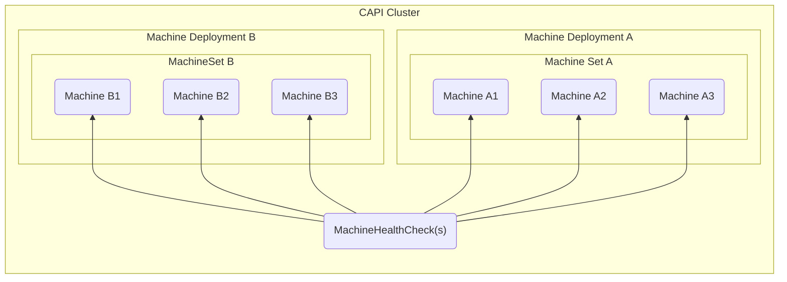
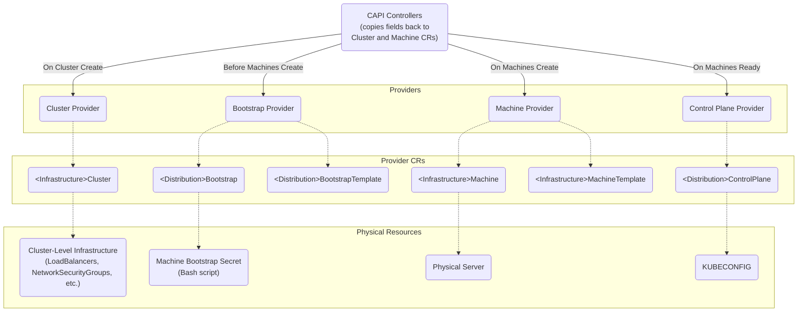

# What is Cluster API (CAPI)?

[Cluster API (CAPI)](https://cluster-api.sigs.k8s.io/introduction.html) is a declarative API for provisioning and managing Kubernetes clusters.

Once CAPI is installed, users are expected to use [`clusterctl`](https://cluster-api.sigs.k8s.io/clusterctl/overview.html), a command line tool that supports commands like:
- `clusterctl init` to install the CAPI and CAPI Provider components that listen to CAPI and CAPI Provider CRDs
- `clusterctl generate cluster` to create the Kubernetes manifest that defines a CAPI Cluster, which consists of CAPI and CAPI Provider CRDs
- `clusterctl get kubeconfig` to get the `KUBECONFIG` of a CAPI-provisioned cluster to be able to communicate with it

## Installing CAPI

To use CAPI, a user must install the **CAPI controllers & CRDs** and one or more **CAPI "Provider" controllers & CRDs** onto a single cluster known as the **local / management** cluster.

This is generally achieved by running `clusterctl init`.

Once CAPI is installed, to create a cluster managed by CAPI (also known as a **downstream** cluster), a user will have to create a number of CAPI resources at the same time in the **local / management** cluster that reference CAPI Provider resources that are created alongside it, including:
- One or more `Machine`s, each of which identify a `<Infrastructure>Machine` and `<Distribution>Bootstrap` CR that implements it
    - A `MachineDeployment` / `MachineSet` similarly references a `<Infrastructure>MachineTemplate` and `<Distribution>BootstrapTemplate` CRs to create a set of `Machine`s, `<Infrastructure>Machine`s, and `<Distribution>Bootstrap`s per replica requested in the spec

> **Note**: `MachineDeployment` : `MachineSet` : `Machine` has the same relationship as `Deployment` : `ReplicaSet` : `Pod`

- A `Cluster`, which identifies a `<Distribution>Cluster` and `<Distribution>ControlPlane` CR that implements it

- One or more `MachineHealthCheck`s, each of which identify periodic actions that need to be executed on `Machine`s to verify they are healthy

> **Note**: On a failed `MachineHealthCheck`, a `Machine` that is part of a `MachineSet` gets deleted and replaced with a fresh `Machine`

You can visualize the relationship between CAPI CRDs **alone** with the following graph:

The manifest containing these resources is what is normally produced by running `clusterctl generate cluster` with the appropriate command-line arguments.

Once these resources are created, it's expected that the CAPI "Provider" controllers will do the "real" work to provision the cluster.

## What is a CAPI Provider?

CAPI has the concept of **providers**, or controllers that are implemented by third-parties (i.e. AWS, Azure, Rancher, etc.) that operate on their own custom CRDs to manage the underlying infrastructure.

In essence, as seen in [the description above](#how-does-capi-provision-clusters), the model for CAPI's cluster provisioning workflow is to execute provisioning with a series of "hand-offs" to providers who implement the "real" code, e.g.
1. User creates a `MachineDeployment`, `MachineSet`, `Machine`, or `Cluster` CR referencing one or more provider CRs that the user also creates, like `<Infrastructure>MachineTemplate`, `<Infrastructure>Machine`, `<Infrastructure>Cluster`, or `<Infrastructure>ControlPlane` by running a single command like `clusterctl generate cluster [name] --kubernetes-version [version] | kubectl apply -f -`
2. The provider detects the creation of its own CRs and does some action. **CAPI watches the provider CRs, but does no action till the provider is done**
3. Once the provider is done processing, the provider updates **certain, well-defined CAPI fields** on its own CRs and the CAPI controllers spring into action; on detecting that change in the provider CRs referenced by a CAPI CR, they **copy over the values of those CAPI fields** from the provider CR to the CAPI CR and persist the modified CAPI CR onto the cluster
4. On detecting the update to the CAPI resource for those well-defined CAPI fields, CAPI is able to continue the provisioning process until the next "hand-off"

> **Note**: Without any providers, CAPI would not be able to do anything since no one is executing the other side of the "hand-off"; it relies on providers to respond back with information on those desired fields to continue execution. This is why you need to deploy CAPI with at least one provider, which usually defaults to the [KubeAdm](https://kubernetes.io/docs/reference/setup-tools/kubeadm/) CAPI provider.

> **Note**: The reason why providers create their own custom CRDs is so that they have full control over adding additional fields under `.status`, `.spec`, or whatever other fields they would like to expose on their CRDs. 
>
> For example, if AWS would like to expose the ability to specify a network security group that will be tied to the provisioned machine (which may not translate to what an on-prem CAPI provider may want to allow users to be able to configure), AWS alone can offer that option in the `.spec` field of its `AWSMachine` CR but CAPI's corresponding `Machine` CR would not need to expose such a field.
>
> The only expectation that CAPI has in turn is that the CRDs themselves have to have certain specific well-defined `status` and `spec` fields, depending on the type of resource that CRD represents. These expectations are outlined in its [provider contract documentation](https://cluster-api.sigs.k8s.io/developer/providers/contracts.html), such as the fact that any CRD implementing `Cluster` needs to have `.spec.controlPlaneEndpoint` so that CAPI can copy that field over to the CAPI `Cluster` CR's `.spec.controlPlaneEndpoint`.
>
> As long as the CRD has those fields, it can be used in the `*Ref` fields (i.e. `infrastructureRef`, `controlPlaneRef`, `bootstrap.configRef`, etc.) of a CAPI CR.

## How Does CAPI Provision Clusters?

CAPI's general workflow for provisioning clusters involves the following steps of "real" work, mostly executed by Providers:
1. Create cluster-level infrastructure pieces **(handled by Cluster Infrastructure Provider)**
2. **ONLY IF** using `MachineDeployment` / `MachineSet`: Create `Machine`, `<Infrastructure>Machine`, and `<Distribution>Bootstrap` objects resources for each replica requested in the `MachineSet` spec **(handled by CAPI Controllers)**
3. Create a Machine Bootstrap Secret per `<Distribution>Bootstrap` that contains the script that needs to be installed right after provisioning a machine to add it to the Kubernetes cluster **(handled by Bootstrap Provider)**
4. Provision a physical server per `<Infrastructure>Machine` by contacting the infrastructure provider (i.e. AWS, Azure, etc.) and running the bootstrap script in the Machine Bootstrap Secret on the machine before marking it as Ready **(handled by Machine Provider)**
5. Copy the `<Infrastructure>Machine` fields over to the corresponding CAPI `Machine` **(handled by CAPI Controllers)**
6. Initialize the cluster's controlplane (only once all `Machine`s are marked as Ready) using the configuration on the `<Distribution>ControlPlane` and join the bootstrapped nodes onto the controlplane; once all `Machine`s are joined, create a `KUBECONFIG` that can be used to access the newly provisioned cluster's Kubernetes API **(handled by ControlPlane Provider)**
7. Copy the `<Distribution>ControlPlane` fields over to the corresponding CAPI `Cluster`, specifically including the control plane endpoint that can be used to communicate with the cluster **(handled by CAPI Controllers)**

Once these steps have been taken, a user can run `clusterctl get kubeconfig` to access the newly provisioned downstream cluster's Kubernetes API.

## Next Up

Next, we will do a deep dive into each of the [CAPI Providers](./01_capi_providers.md) that CAPI expects to be implemented by a third-party (i.e. Rancher in Provisioning V2)!
