## Hands-On Walkthrough Of Provisioning V2

First, provision a Rancher management cluster.

Then, run the following command:

```bash
# This grabs all the API groups related to Rancher or CAPI
APIGROUPS="rke-machine.cattle.io\|rke-machine-config.cattle.io\|cluster.x-k8s.io\|rke.cattle.io\|provisioning.cattle.io"

# This runs the kubectl get command to get all resources tied to any of those API Groups
kubectl get -A $(kubectl api-resources -o'name' | grep "${APIGROUPS}" | xargs | sed 's/ /,/g' -)
```

On running this command, you should see the following output:

```log
NAMESPACE     NAME                                   READY   KUBECONFIG
fleet-local   cluster.provisioning.cattle.io/local   true    local-kubeconfig
```

This is expected since, on initially starting up, we only have a local cluster, which is not managed by CAPI.

> **Note**: Why is this cluster in the `fleet-local` namespace?
>
> Provisioning V2 is heavily tied in with [`rancher/fleet`](https://github.com/rancher/fleet). 
>
> On creating a Provisioning V2 cluster, Rancher's controllers automatically create a child Fleet Cluster in the management cluster, which is picked up by the Fleet manager running the management cluster (deployed by Rancher itself) to register the newly created downstream cluster with Fleet.
>
> You can see this Fleet cluster by running `kubectl get -n fleet-local clusters.fleet.cattle.io`, which should be called `local` and have wrangler annotations identifying its parent as the cluster outputted above.
>
> For this walkthrough / document, we're focused on Provisioning V2 only, so the integration between Provisioning V2 and Fleet and the registration process for Fleet clusters will not be covered.

Once you have verified that only that local cluster exists, provision a cluster of your choice using Rancher. 

### Example 1: Single-node RKE2 / K3s cluster provisioned in Digital Ocean

While it's provisioning (or after it is provisioned), run the same command above but set the namespace in the `kubectl` command to `fleet-default`, to avoid showing anything about the management cluster in the output. For your convienience, this has been copied and pasted below:

```bash
# This grabs all the API groups related to Rancher or CAPI
APIGROUPS="rke-machine.cattle.io\|rke-machine-config.cattle.io\|cluster.x-k8s.io\|rke.cattle.io\|provisioning.cattle.io"

# Ths runs the kubectl get command to get all resources tied to any of those API Groups from fleet-default
kubectl get -n fleet-default $(kubectl api-resources -o'name' | grep "${APIGROUPS}" | xargs | sed 's/ /,/g' -)
```

On running this command, you should see the following resources have been created per API group (where `<name>` is the name you provided to create the cluster and `<machinePool>` is the name you provided each Machine Pool on the UI).

> **Note**: If you look at the actual network calls being made (via Developer Tools) when you click on the button the `Create` the cluster, you'll notice that **exactly two resources** from the below list are actually created by the user (i.e. tied to `PUT` or `POST` requests executed by the Rancher UI running on your browser):
> - The `provisioning.cattle.io` Cluster
> - Each `DigitalOceanConfig`, which will be tied to the each `Machine Pool` you added on the UI
>
> If you were using Provisioning V2 without the help of the Rancher UI, these are exactly the resources you would need to create to automatically create all of the other resources.

```mermaid
graph LR;
    %% CSS Styling

    classDef ProvisioningV2 fill:#645c5a;
    classDef RancherBootstrap fill:#351c75;
    classDef RancherInfrastructure fill:#04596c;
    classDef CAPI fill:#89164f;
    classDef RKEPlanner fill:#8a871e;

    %% Resources

    %%%% Parent Resources
    DigitalOceanConfig("DigitalOceanConfig(s)"):::RancherInfrastructure;
    v1Cluster("provisioning.cattle.io Cluster"):::ProvisioningV2;

    %%%% v1.Cluster Children
    subgraph On provisioning.cattle.io Create
    capiCluster("CAPI Cluster"):::CAPI;
    MachineDeployment("MachineDeployment(s)"):::CAPI;
    DigitalOceanMachineTemplate("DigitalOceanMachineTemplate(s)"):::RancherInfrastructure;
    RKEBootstrapTemplate("RKEBootstrapTemplate(s)"):::RancherBootstrap;
    RKECluster("RKECluster"):::RancherBootstrap;
    RKEControlPlane("RKEControlPlane"):::RancherBootstrap;
    end

    %%%% MachineDeployment Children
    subgraph On MachineDeployment Create
    MachineSet("MachineSet(s)"):::CAPI;
    end

    %%%% MachineSet Children
    subgraph On MachineSet Create
    Machine("Machine(s)"):::CAPI;
    DigitalOceanMachine("DigitalOceanMachines(s)"):::RancherInfrastructure;
    RKEBootstrap("RKEBootstrap(s)"):::RancherBootstrap;
    end

    %%%% RKEBootstrap Children
    subgraph On RKEBootstrap Create
      MachinePlanSecret("MachinePlanSecret(s)"):::RKEPlanner
      MachineBootstrapSecret("MachineBootstrapSecret(s)"):::RancherBootstrap
    end

    %%%% DigitalOceanMachine Children
    subgraph On DigitalOceanMachine Create
    RancherMachineJob("Rancher Machine Job(s)")
    end

    RKEPlannerController("RKE Planner Controller"):::RKEPlanner
    PhysicalServer("Physical Server(s)")

    %% Relationships

    %%%% MachinePool to Cluster
    DigitalOceanConfig-->v1Cluster;

    %%%% v1.Cluster Children
    v1Cluster-->capiCluster
    v1Cluster-->DigitalOceanMachineTemplate;
    v1Cluster-->MachineDeployment;
    v1Cluster-->RKEBootstrapTemplate;
    v1Cluster-->RKECluster;
    v1Cluster-->RKEControlPlane;
    
    %%%% RKE Cluster References
    RKECluster-.->RKEControlPlane

    %%%% CAPI Cluster References
    capiCluster-.->RKECluster
    capiCluster-.->RKEControlPlane

    %%%% MachineDeployment Children
    MachineDeployment-->MachineSet
    MachineDeployment-.->DigitalOceanMachineTemplate
    MachineDeployment-.->RKEBootstrapTemplate
    
    %%%% MachineSet 
    MachineSet-->Machine
    MachineSet-->DigitalOceanMachine
    MachineSet-->RKEBootstrap

    %%%% Machine and DigitalOceanMachineTemplate
    Machine-.->DigitalOceanMachine
    DigitalOceanMachineTemplate-->DigitalOceanMachine

    %%%% Machine and RKEBootstrapTemplate
    Machine-.->RKEBootstrap
    RKEBootstrapTemplate-->RKEBootstrap

    %%%% DigitalOceanMachine Children
    DigitalOceanMachine-->RancherMachineJob
    RancherMachineJob-->PhysicalServer

    %%%% Secrets
    RKEBootstrap-->MachineBootstrapSecret
    MachineBootstrapSecret-->RancherMachineJob
    RKEBootstrap--Empty On Create-->MachinePlanSecret
    RKEControlPlane-->RKEPlannerController
    RKEPlannerController--Filled In On Updates-->MachinePlanSecret
    MachinePlanSecret-->PhysicalServer
```



Within the main `provisioning.cattle.io` API Group:
- **Cluster (`<name>`)**: this is a **user-created object** that is the parent of **most** other objects listed here, except:
  - The `DigitalOceanConfig`, which is also created by the user
  - The `MachineSet` / `Machine`, which is created by the CAPI controllers on seeing the `MachineDeployment` created and owned by this cluster object
  - The `DigitalOceanMachine`, which is created by the CAPI controllers on seeing the `DigitalOceanMachineTemplate` tied to a `MachineDeployment` or `MachineSet`
  - The `RKEBootstrap`, which is created by the CAPI controllers on seeing the `RKEBootstrapTemplate` tied to a `MachineDeployment` or `MachineSet`

> **Note**: If the Cluster's `.spec.rkeConfig` is set to `nil`, none of the below CAPI resources will be created since the `.spec.rkeConfig` is what contains the configuration passed on to the Rancher Bootstrap Provider's `RKEControlPane` and the Machine Pools that cause the Rancher Infrastructure Provider's `DigitalOceanMachineTemplate`s to be created.
>
> For example, this is the case for the local `provisioning.cattle.io` Cluster object in the `fleet-local` namespace that was identified above, since we don't need to use CAPI on an already provisioned cluster.

CAPI resources, identified by the API Group `cluster.x-k8s.io`:
- **Cluster (`<name>`)**: this is the core cluster that CAPI recognizes and registers. You should see in its annotations that it is owned by the `provisioning.cattle.io` Cluster listed above. You'll also see its `.spec.controlPlaneRef` and `.spec.infrastructureRef` are tied to the underlying Rancher Bootstrap Provider CRs, `RKEControlPlane` and `RKECluster`
- **MachineDeployment (`<name>-<machinePool>`)**: this is the core machine deployment that CAPI recognizes and registers; you should see one of these per Machine Pool that you had defined. You should see in its annotations that it is owned by the `provisioning.cattle.io` Cluster listed above. You'll also see its `.spec.infrastructureRef` is tied to the underlying `DigitalOceanMachineTemplate` in the Rancher Infrastructure Provider CRs and its `.spec.bootstrap.configRef` is tied to the underlying `RKEBootstrapTemplate` in the Rancher Bootstrap Provider CRs
- **MachineSet (`<name>-<machinePool>-<$RANDOM>`)**: this is the underlying component the `MachineDeployment` above creates. Nothing specific to see here
- **Machine (`<name>-<machinePool>-<$RANDOM>-<$RANDOM>`)**: this is the underlying component the `MachineSet` above creates. Nothing specific to see here, except the fact that its `.spec.infrastructureRef` is tied to the underlying `DigitalOceanMachine` in the Rancher Infrastructure Provider CRs its `.spec.bootstrap.ConfigRef` is tied to the underlying `RKEBootstrap` in the Rancher Bootstrap Provider CRs rather than the `DigitalOceanMachineTemplate` or `RKEBootstrapTemplate`, respectively

Rancher Infrastructure Provider resources, under the API Group `rke-machine.cattle.io`:
- **DigitalOceanConfig (`nc-<name>-<machinePool>-<$RANDOM>`)**: this is a **user-created object** that identifies the DigitalOcean node configuration (which is why it is prefixed with `nc-`) that should be used for a specific Machine Pool listed in the `provisioning.cattle.io` Cluster. It is referenced in the `.spec.rkeConfig.machinePools[*].machineConfigRef` field of the `provisioning.cattle.io` Cluster; if you created multiple Machine Pools to provision your cluster, you should see exactly that many `DigitialOceanConfig`s
- **DigitalOceanMachineTemplate (`<name>-<machinePool>-<$RANDOM>`)**: this is the machine template that the Rancher Infrastructure Provider recognizes and registers. You should see in its annotations that it is owned by the `provisioning.cattle.io` Cluster listed above. It is referenced in the `.spec.infrastructureRef` field of a CAPI `MachineDeployment` or `MachineSet`
- **DigitalOceanMachine (`<name>-<machinePool>-<$RANDOM>-<$RANDOM>`)**: this is the the actual machine that the Rancher Infrastructure Provider recognizes and registers. This resource is created by CAPI controllers per replica requested in the CAPI `MachineDeployment` or `MachineSet` based on the attached `DigitalOceanMachineTemplate`. It is referenced in the `.spec.infrastructureRef` field of a CAPI `Machine`; every CAPI `Machine` is expected to have its own unique `DigitalOceanMachine` tied to it

> **Note**: If you run `kubectl get crds digitaloceanconfigs.rke-machine-config.cattle.io -o=jsonpath='{.spec.versions[0].schema.openAPIV3Schema.properties}'` in your cluster to see the valid properties that can be set in the `DigitalOceanConfig` object, you'll see that the fields in the CRD **exactly match every command line arguments offered by that driver prefixed by `--digitalocean-`** in [`rancher/machine`](https://github.com/rancher/machine).
>
> To verify this, run `./path/to/binary/rancher-machine create -d digitalocean` and look at the arguments that start with `--digitalocean-`.
>
> This is by design; as detailed in the docs about the [Rancher Generic Infrastructure Provider](./provisioning.md#ranchers-generic-infrastructure-provider), Rancher utilizes `rancher/machine` under the hood to create these CRDs and perform the provisioning operation through the relevant driver.

Rancher Bootstrap Provider resources, under the API Group `rke.cattle.io`:
- **RKECluster (`<name>`)**: this is the cluster that the Rancher Bootstrap Provider recognizes and registers. You should see in its annotations that it is owned by the `provisioning.cattle.io` Cluster listed above. You'll also see its `.spec.controlPlaneEndpoint` is filled in and matches that of the CAPI `Cluster` (since it was copied over)
- **RKEControlPlane (`<name>`)**: this is the control plane that the Rancher Bootstrap Provider recognizes and registers. You should see in its annotations that it is owned by the `provisioning.cattle.io` Cluster listed above. You'll also see its `.spec` precisely matches the `.spec.rkeConfig` from the `provisioning.cattle.io` Cluster (since it was copied on creating the child object). This represents the user provided values on creating or modifying the cluster
- **RKEBootstrapTemplate (`<name>-bootstrap-template`)**: this is the bootstrap configuration template that the Rancher Bootstrap Provider recognizes and registers. You should see in its annotations that it is owned by the `provisioning.cattle.io` Cluster listed above. It is referenced in the `.spec.bootstrap.configRef` field of a CAPI `MachineDeployment` or `MachineSet`
- **RKEBootstrap (`<name>-bootstrap-template-<$RANDOM>`)**: this is the bootstrap configuration that the Rancher Bootstrap Provider recognizes and registers. Under `.status.dataSecretName`, it lists an ephemeral secret name that will contain a script that will be run on provisioned infrastructure; this script's purpose is to install `rancher/system-agent` onto the node as a [`systemd`](https://systemd.io/) Service (since this action is the same for all nodes, there's no other real `.spec` fields in this CR). It will disappear once the machine is no longer in one of the following stages: `Pending`, `Deleting`, `Failed`, or `Provisioning`. This resource is created by CAPI controllers per replica requested in the CAPI `MachineDeployment` or `MachineSet` based on the attached `RKEBootstrapTemplate`. It is referenced in the `.spec.bootstrap.configRef` field of a CAPI `Machine`; every CAPI `Machine` is expected to have its own unique `RKEBootstrap` tied to it

### Example 2: Single-node Custom RKE2 / K3s cluster

After creating the cluster object **but before you add any nodes**, run the same command above but set the namespace in the `kubectl` command to `fleet-default`, to avoid showing anything about the management cluster in the output. For your convienience, this has been copied and pasted below:

```bash
# This grabs all the API groups related to Rancher or CAPI
APIGROUPS="rke-machine.cattle.io\|rke-machine-config.cattle.io\|cluster.x-k8s.io\|rke.cattle.io\|provisioning.cattle.io"

# This runs the kubectl get command to get all resources tied to any of those API Groups from fleet-default
kubectl get -n fleet-default $(kubectl api-resources -o'name' | grep "${APIGROUPS}" | xargs | sed 's/ /,/g' -)
```

On running this command, you should see the following resources have been created per API group (where `<name>` is the name you provided to create the cluster).

Within the main `provisioning.cattle.io` API Group:
- **Cluster (`<name>`)**: this is a **user-created object** that is the parent of **all** other objects listed here

CAPI resources, identified by the API Group `cluster.x-k8s.io`:
- **Cluster (`<name>`)**: this is the core cluster that CAPI recognizes and registers. You should see in its annotations that it is owned by the `provisioning.cattle.io` Cluster listed above. You'll also see its `.spec.controlPlaneRef` and `.spec.infrastructureRef` are tied to the underlying Rancher Bootstrap Provider CRs, `RKEControlPlane` and `RKECluster`. You should also see that it is stuck in the `Provisioning` state, with no `.spec.controlPlaneEndpoint` set.

Rancher Bootstrap Provider resources, under the API Group `rke.cattle.io`:
- **RKECluster (`<name>`)**: this is the cluster that the Rancher Bootstrap Provider recognizes and registers. You should see in its annotations that it is owned by the `provisioning.cattle.io` Cluster listed above. You'll also see its `.spec.controlPlaneEndpoint` is filled in to `localhost:6443` but does **not** match that of the CAPI `Cluster` (which is currently empty)
- **RKEControlPlane (`<name>`)**: this is the control plane that the Rancher Bootstrap Provider recognizes and registers. You should see in its annotations that it is owned by the `provisioning.cattle.io` Cluster listed above. You'll also see its `.spec` precisely matches the `.spec.rkeConfig` from the `provisioning.cattle.io` Cluster (since it was copied on creating the child object). This represents the user provided values on creating or modifying the cluster

However, to actually add a node to this provisioned cluster, you will need to run a **registration command** on an **already provisioned node**.

So at this step, I will provision a node and run the registration command provided by the Rancher UI on it, which should look something like this:

```bash
curl -fL https://<RANCHER_URL>/system-agent-install.sh | sudo  sh -s - --server https://<RANCHER_URL> --label 'cattle.io/os=linux' --token <SOME_TOKEN> --ca-checksum <SOME_CHECKSUM> --etcd --controlplane --worker
```

This effectively runs the `system-agent-install.sh` script hosted on the Rancher URL (which is precisely the [`install.sh` found in the `rancher/system-agent` repo](https://github.com/rancher/system-agent/blob/main/install.sh)) to install the system-agent onto the node with the provided token and CA Checksum for a node that should take on the role of `etcd`, `controlplane`, and `worker`.

Since this takes care of installing the system agent on the provisioned node, the role that we expected Rancher's Bootstrap Provider to take care of has already been accomplished; therefore, there's no need to create any `<Infrastructure>*` CRs in the cluster.

However, we do need to do two things:
1. Create a CAPI `Machine` object and something it can reference under `.spec.infrastructureRef` that tells CAPI that it's safe to proceed
2. Create a dummy `RKEBootstrap` that can be referenced by the `Machine` object under `.spec.bootstrap.configRef` so that CAPI doesn't fail out, despite the fact that our bootstrapping is already complete

To do this, the script will automatically also make a request to the Rancher API at `https://<RANCHER_URL>/v3/connect/agent`, which points to the **RKE Config Server** running in Rancher.

On seeing a request from a machine, the **RKE Config Server** will attempt to see if the machine is already registered (in which case it will do nothing); if the machine is not registered, it will create a ephemeral Secret of the type `rke.cattle.io/machine-request` named `custom-<hash-of-machine-name>` in the same namespace; this Secret will effectively just contain the headers on the request that was made to Rancher.

On seeing a Secret of this type get created, the Provisioning V2 controllers will automatically create a couple of objects on behalf of the Secret (which is subsequently deleted after 1 minute):
- The CAPI `Machine`
- A `CustomMachine`, which takes the place of an `<Infrastructure>Machine`. It's the only type of Infrastructure Provider CRD that the Rancher Infrastructure Provider controllers will ignore and not do any processing for.
- A dummy `RKEBootstrap` that is referenced by the CAPI `Machine`

On running the same command from above, you should see that these resources were created and, since the Rancher controllers will always mark a `CustomMachine`'s status as immediately `Ready`, you should see that the cluster successfully finishes provisioning momentarily.

## Utility Functions

To see the specific resources owned by a specific parent object, you can run the following utility commands:

```bash
WRANGLER_APPLY_ID=$(echo "objectset.rio.cattle.io/id" | sed 's/\./\\./g')
WRANGLER_APPLY_OWNER_NAME=$(echo "objectset.rio.cattle.io/owner-name" | sed 's/\./\\./g')
WRANGLER_APPLY_OWNER_NAMESPACE=$(echo "objectset.rio.cattle.io/owner-namespace" | sed 's/\./\\./g')
WRANGLER_APPLY_OWNER_GVK=$(echo "objectset.rio.cattle.io/owner-gvk" | sed 's/\./\\./g')

EXCLUDE_RESOURCES="^bindings$\|^tokenreviews.authentication.k8s.io$\|^localsubjectaccessreviews.authorization.k8s.io$\|^selfsubjectaccessreviews.authorization.k8s.io$\|^selfsubjectrulesreviews.authorization.k8s.io$\|^subjectaccessreviews.authorization.k8s.io$"

# A utility function if you are finding that errors are coming from calling get-children or get-parents
# The output that should be expected in most normal clusters is listed above.
# That should work in most situations without needing to ever call this function.
sync-exclude-resources() {
  EXCLUDE_RESOURCES=^$(for r in $(kubectl api-resources -o'name'); do if ! kubectl get $r 2>/dev/null 1>/dev/null; then echo "${r}"; fi; done | xargs | sed 's/ /$\\|^/g' -)$
}

get-orphans() {
  get-children "" | sort -rn
}

get-parents() {
  # Specific resource types that can be ignored
  kubectl get -A $(kubectl api-resources -o'name' | grep -v ${EXCLUDE_RESOURCES} | xargs | sed 's/ /,/g' -) -o=jsonpath="{range .items[?(@.metadata.annotations.${WRANGLER_APPLY_ID}!=\"\")]}{ .metadata.annotations.${WRANGLER_APPLY_ID} }{ \"\n\"}{ end }" | sort | uniq -c | sort -rn
}

get-desiredset() {
  parent=$1
  kubectl get -A $(kubectl api-resources -o'name' | grep -v ${EXCLUDE_RESOURCES} | xargs | sed 's/ /,/g' -) -o=jsonpath="{range .items[?(@.metadata.annotations.${WRANGLER_APPLY_ID}==\"${parent}\")]}{ .metadata.annotations.${WRANGLER_APPLY_OWNER_GVK} } { .metadata.annotations.${WRANGLER_APPLY_OWNER_NAMESPACE} } { .metadata.annotations.${WRANGLER_APPLY_OWNER_NAME} }{ \"\n\"}{ end }" 2>/dev/null | sort -rn | uniq | \
  while read owner; do
    echo "---"
    echo "desiredSet: ${parent}"
    if [[ -z "${owner}" ]]; then
      echo "owner: null"
      echo "resources:"
      get-children "${parent}" 2>/dev/null | awk '{
        if ($4!="") {
          print "- apiGroup: " $1 "\n  kind: " $2 "\n  namespace: " $3 "\n  name: " $4
        } else if ($3!="") {
          print "- apiGroup: " $1 "\n  kind: " $2 "\n  name: " $3
        } else {
          print "- apiGroup: " $1 "\n  kind: " $2
        }
      }'
      continue
    fi
    echo "owner:"
    owner_gvk=$(echo ${owner} | awk '{print $1 "  " $2}')
    owner_namespace=$(echo ${owner} | awk '{print $3}')
    owner_name=$(echo ${owner} | awk '{print $4}')
    echo "  gvk: ${owner_gvk}"
    if [[ -z "${owner_name}" ]]; then
      echo "  name: ${owner_namespace}"
    elif [[ -n "${owner_namespace}" ]]; then
      echo "  namespace: ${owner_namespace}"
      echo "  name: ${owner_name}"
    fi
    echo "resources:"
    get-children "${parent}" 2>/dev/null | grep "${owner}" - | awk '{
      if ($8!="") {
        print "- apiGroup: " $5 "\n  kind: " $6 "\n  namespace: " $7 "\n  name: " $8
      } else if ($7!="") {
        print "- apiGroup: " $5 "\n  kind: " $6 "\n  name: " $7
      } else {
        print "- apiGroup: " $5 "\n  kind: " $6
      }
    }'
    echo ""
  done
}

get-desiredsets() {
  for parent in $(get-parents 2>/dev/null | awk '{print $2}'); do
    get-desiredset ${parent}
  done
}

# Get the names of all desired sets and the number of resources that they own in your cluster
get-parents

# Get all resources owned by a desired set
get-children "dynamic-driver-crd"

# Get all resources owned by a parent resource
get-desiredsets

# v1 Cluster Resources
get-desiredset "rke-cluster"

# Bootstrap and Machine Plan Secrets
get-desiredset "rke-machine"

# Custom Cluster Machines
get-desiredset "unmanaged-machine"

# Infrastructure Provider CRDs
get-desiredset "dynamic-driver-crd"

# Cluster Management with v1 parent
get-desiredset "cluster-create"

# Cluster Management with v3 parent
get-desiredset "provisioning-cluster-create"

# Resources that aren't tied to a specific object set ID
# The machine-state Secret for each provisioned machine falls in this
get-desiredset ""
```